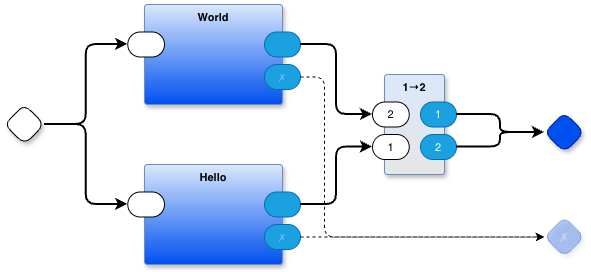
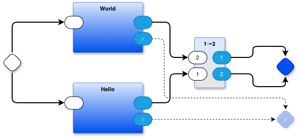

Let's work on a simple example, the helloworld example that uses Python Leaf components and uses top-level source code called `helloworldpy.drawio`.

The top-level source code was generated using the drawio diagram editor which saved the 2D drawing out as a big block of 1D text in the form of `graphML` (an instance of XML).

Here is `helloworldpy.drawio`:
```
<mxfile host="Electron" agent="Mozilla/5.0 (Macintosh; Intel Mac OS X 10_15_7) AppleWebKit/537.36 (KHTML, like Gecko) draw.io/29.3.6 Chrome/140.0.7339.249 Electron/38.8.0 Safari/537.36" version="29.3.6">
  <diagram name="main" id="o9M2tmKP6ZUbm1JD93Ax">
    <mxGraphModel dx="1106" dy="470" grid="1" gridSize="10" guides="1" tooltips="1" connect="1" arrows="1" fold="1" page="1" pageScale="1" pageWidth="1100" pageHeight="850" math="0" shadow="0">
      <root>
        <mxCell id="0" />
        <mxCell id="1" parent="0" />
        <mxCell id="n8kg52j3blKjJ06txv2A-1" parent="1" style="rhombus;whiteSpace=wrap;html=1;rounded=1;fontStyle=1;glass=0;sketch=0;fontSize=12;points=[[0,0.5,0,0,0],[0.5,0,0,0,0],[0.5,1,0,0,0],[1,0.5,0,0,0]];shadow=1;fontFamily=Helvetica;fontColor=default;labelBackgroundColor=none;" value="" vertex="1">
          <mxGeometry height="40" width="40" x="100" y="220" as="geometry" />
        </mxCell>
        <mxCell id="n8kg52j3blKjJ06txv2A-2" parent="1" style="rhombus;whiteSpace=wrap;html=1;rounded=1;fontStyle=1;glass=0;sketch=0;fontSize=12;points=[[0,0.5,0,0,0],[0.5,0,0,0,0],[0.5,1,0,0,0],[1,0.5,0,0,0]];shadow=1;fillColor=#0050ef;fontColor=#ffffff;strokeColor=#001DBC;fontFamily=Helvetica;labelBackgroundColor=none;" value="" vertex="1">
          <mxGeometry height="40" width="40" x="640" y="228" as="geometry" />
        </mxCell>
        <mxCell id="n8kg52j3blKjJ06txv2A-24" parent="1" style="rounded=1;whiteSpace=wrap;html=1;container=1;recursiveResize=0;verticalAlign=top;arcSize=6;fontStyle=1;autosize=0;points=[];absoluteArcSize=1;shadow=1;strokeColor=#6c8ebf;fillColor=#dae8fc;fontFamily=Helvetica;fontSize=11;gradientColor=#E6E6E6;fontColor=default;labelBackgroundColor=none;" value="1→2" vertex="1">
          <mxGeometry height="100" width="60" x="480" y="190" as="geometry">
            <mxRectangle height="26" width="99" x="-98" y="-1230" as="alternateBounds" />
          </mxGeometry>
        </mxCell>
        <mxCell id="n8kg52j3blKjJ06txv2A-25" parent="n8kg52j3blKjJ06txv2A-24" style="rounded=1;whiteSpace=wrap;html=1;sketch=0;points=[[0,0.5,0,0,0],[1,0.5,0,0,0]];arcSize=50;fontFamily=Helvetica;fontSize=11;fontColor=default;labelBackgroundColor=none;" value="2" vertex="1">
          <mxGeometry height="25" width="36.75" x="-12" y="27.5" as="geometry" />
        </mxCell>
        <mxCell id="n8kg52j3blKjJ06txv2A-26" parent="n8kg52j3blKjJ06txv2A-24" style="rounded=1;whiteSpace=wrap;html=1;sketch=0;points=[[0,0.5,0,0,0],[1,0.5,0,0,0]];fillColor=#1ba1e2;fontColor=#ffffff;strokeColor=#006EAF;arcSize=50;fontFamily=Helvetica;fontSize=11;labelBackgroundColor=none;" value="1" vertex="1">
          <mxGeometry height="25" width="36" x="36" y="27.5" as="geometry" />
        </mxCell>
        <mxCell id="n8kg52j3blKjJ06txv2A-27" parent="n8kg52j3blKjJ06txv2A-24" style="rounded=1;whiteSpace=wrap;html=1;sketch=0;points=[[0,0.5,0,0,0],[1,0.5,0,0,0]];arcSize=50;fontFamily=Helvetica;fontSize=11;fontColor=default;labelBackgroundColor=none;" value="1" vertex="1">
          <mxGeometry height="25" width="36.75" x="-12" y="60" as="geometry" />
        </mxCell>
        <mxCell id="n8kg52j3blKjJ06txv2A-28" parent="n8kg52j3blKjJ06txv2A-24" style="rounded=1;whiteSpace=wrap;html=1;sketch=0;points=[[0,0.5,0,0,0],[1,0.5,0,0,0]];fillColor=#1ba1e2;fontColor=#ffffff;strokeColor=#006EAF;arcSize=50;fontFamily=Helvetica;fontSize=11;labelBackgroundColor=none;" value="2" vertex="1">
          <mxGeometry height="25" width="36" x="36" y="60" as="geometry" />
        </mxCell>
        <mxCell id="n8kg52j3blKjJ06txv2A-29" edge="1" parent="1" source="n8kg52j3blKjJ06txv2A-26" style="edgeStyle=orthogonalEdgeStyle;shape=connector;curved=0;rounded=1;orthogonalLoop=1;jettySize=auto;html=1;exitX=1;exitY=0.5;exitDx=0;exitDy=0;exitPerimeter=0;entryX=0;entryY=0.5;entryDx=0;entryDy=0;entryPerimeter=0;strokeColor=default;strokeWidth=2;align=center;verticalAlign=middle;fontFamily=Helvetica;fontSize=11;fontColor=default;labelBackgroundColor=default;endArrow=classic;" target="n8kg52j3blKjJ06txv2A-2">
          <mxGeometry relative="1" as="geometry" />
        </mxCell>
        <mxCell id="n8kg52j3blKjJ06txv2A-30" edge="1" parent="1" source="n8kg52j3blKjJ06txv2A-28" style="edgeStyle=orthogonalEdgeStyle;shape=connector;curved=0;rounded=1;orthogonalLoop=1;jettySize=auto;html=1;exitX=1;exitY=0.5;exitDx=0;exitDy=0;exitPerimeter=0;entryX=0;entryY=0.5;entryDx=0;entryDy=0;entryPerimeter=0;strokeColor=default;strokeWidth=2;align=center;verticalAlign=middle;fontFamily=Helvetica;fontSize=11;fontColor=default;labelBackgroundColor=default;endArrow=classic;" target="n8kg52j3blKjJ06txv2A-2">
          <mxGeometry relative="1" as="geometry" />
        </mxCell>
        <mxCell id="wK0F3og9NH9Dy6XDwJbj-1" parent="1" style="rounded=1;whiteSpace=wrap;html=1;container=1;recursiveResize=0;verticalAlign=top;arcSize=6;fontStyle=1;autosize=0;points=[];absoluteArcSize=1;shadow=1;strokeColor=#6c8ebf;fillColor=#dae8fc;fontFamily=Helvetica;fontSize=11;gradientColor=#0050EF;fontColor=default;labelBackgroundColor=none;" value="World" vertex="1">
          <mxGeometry height="100" width="138" x="240" y="120" as="geometry">
            <mxRectangle height="26" width="99" x="-98" y="-1230" as="alternateBounds" />
          </mxGeometry>
        </mxCell>
        <mxCell id="wK0F3og9NH9Dy6XDwJbj-2" parent="wK0F3og9NH9Dy6XDwJbj-1" style="rounded=1;whiteSpace=wrap;html=1;sketch=0;points=[[0,0.5,0,0,0],[1,0.5,0,0,0]];arcSize=50;fontFamily=Helvetica;fontSize=11;fontColor=default;labelBackgroundColor=none;" value="" vertex="1">
          <mxGeometry height="25" width="36.75" x="-16.75" y="27.5" as="geometry" />
        </mxCell>
        <mxCell id="wK0F3og9NH9Dy6XDwJbj-3" parent="wK0F3og9NH9Dy6XDwJbj-1" style="rounded=1;whiteSpace=wrap;html=1;sketch=0;points=[[0,0.5,0,0,0],[1,0.5,0,0,0]];fillColor=#1ba1e2;fontColor=#ffffff;strokeColor=#006EAF;arcSize=50;fontFamily=Helvetica;fontSize=11;labelBackgroundColor=none;" value="" vertex="1">
          <mxGeometry height="25" width="36" x="120" y="27.5" as="geometry" />
        </mxCell>
        <mxCell id="wK0F3og9NH9Dy6XDwJbj-4" parent="wK0F3og9NH9Dy6XDwJbj-1" style="rounded=1;whiteSpace=wrap;html=1;sketch=0;points=[[0,0.5,0,0,0],[1,0.5,0,0,0]];fillColor=#1ba1e2;fontColor=#ffffff;strokeColor=#006EAF;arcSize=50;fontFamily=Helvetica;fontSize=11;textOpacity=30;labelBackgroundColor=none;" value="✗" vertex="1">
          <mxGeometry height="25" width="36" x="120" y="60" as="geometry" />
        </mxCell>
        <mxCell id="wK0F3og9NH9Dy6XDwJbj-5" parent="1" style="rounded=1;whiteSpace=wrap;html=1;container=1;recursiveResize=0;verticalAlign=top;arcSize=6;fontStyle=1;autosize=0;points=[];absoluteArcSize=1;shadow=1;strokeColor=#6c8ebf;fillColor=#dae8fc;fontFamily=Helvetica;fontSize=11;gradientColor=#0050EF;fontColor=default;labelBackgroundColor=none;" value="Hello" vertex="1">
          <mxGeometry height="100" width="138" x="240" y="280" as="geometry">
            <mxRectangle height="26" width="99" x="-98" y="-1230" as="alternateBounds" />
          </mxGeometry>
        </mxCell>
        <mxCell id="wK0F3og9NH9Dy6XDwJbj-6" parent="wK0F3og9NH9Dy6XDwJbj-5" style="rounded=1;whiteSpace=wrap;html=1;sketch=0;points=[[0,0.5,0,0,0],[1,0.5,0,0,0]];arcSize=50;fontFamily=Helvetica;fontSize=11;fontColor=default;labelBackgroundColor=none;" value="" vertex="1">
          <mxGeometry height="25" width="36.75" x="-16.75" y="27.5" as="geometry" />
        </mxCell>
        <mxCell id="wK0F3og9NH9Dy6XDwJbj-7" parent="wK0F3og9NH9Dy6XDwJbj-5" style="rounded=1;whiteSpace=wrap;html=1;sketch=0;points=[[0,0.5,0,0,0],[1,0.5,0,0,0]];fillColor=#1ba1e2;fontColor=#ffffff;strokeColor=#006EAF;arcSize=50;fontFamily=Helvetica;fontSize=11;labelBackgroundColor=none;" value="" vertex="1">
          <mxGeometry height="25" width="36" x="120" y="27.5" as="geometry" />
        </mxCell>
        <mxCell id="wK0F3og9NH9Dy6XDwJbj-8" parent="wK0F3og9NH9Dy6XDwJbj-5" style="rounded=1;whiteSpace=wrap;html=1;sketch=0;points=[[0,0.5,0,0,0],[1,0.5,0,0,0]];fillColor=#1ba1e2;fontColor=#ffffff;strokeColor=#006EAF;arcSize=50;fontFamily=Helvetica;fontSize=11;textOpacity=30;labelBackgroundColor=none;" value="✗" vertex="1">
          <mxGeometry height="25" width="36" x="120" y="60" as="geometry" />
        </mxCell>
        <mxCell id="wK0F3og9NH9Dy6XDwJbj-9" edge="1" parent="1" source="n8kg52j3blKjJ06txv2A-1" style="edgeStyle=orthogonalEdgeStyle;rounded=1;orthogonalLoop=1;jettySize=auto;html=1;exitX=1;exitY=0.5;exitDx=0;exitDy=0;exitPerimeter=0;entryX=0;entryY=0.5;entryDx=0;entryDy=0;entryPerimeter=0;curved=0;strokeWidth=2;" target="wK0F3og9NH9Dy6XDwJbj-2">
          <mxGeometry relative="1" as="geometry" />
        </mxCell>
        <mxCell id="wK0F3og9NH9Dy6XDwJbj-10" edge="1" parent="1" source="n8kg52j3blKjJ06txv2A-1" style="edgeStyle=orthogonalEdgeStyle;shape=connector;curved=0;rounded=1;orthogonalLoop=1;jettySize=auto;html=1;exitX=1;exitY=0.5;exitDx=0;exitDy=0;exitPerimeter=0;entryX=0;entryY=0.5;entryDx=0;entryDy=0;entryPerimeter=0;strokeColor=default;strokeWidth=2;align=center;verticalAlign=middle;fontFamily=Helvetica;fontSize=11;fontColor=default;labelBackgroundColor=default;endArrow=classic;" target="wK0F3og9NH9Dy6XDwJbj-6">
          <mxGeometry relative="1" as="geometry" />
        </mxCell>
        <mxCell id="wK0F3og9NH9Dy6XDwJbj-11" edge="1" parent="1" source="wK0F3og9NH9Dy6XDwJbj-3" style="edgeStyle=orthogonalEdgeStyle;shape=connector;curved=0;rounded=1;orthogonalLoop=1;jettySize=auto;html=1;exitX=1;exitY=0.5;exitDx=0;exitDy=0;exitPerimeter=0;entryX=0;entryY=0.5;entryDx=0;entryDy=0;entryPerimeter=0;strokeColor=default;strokeWidth=2;align=center;verticalAlign=middle;fontFamily=Helvetica;fontSize=11;fontColor=default;labelBackgroundColor=default;endArrow=classic;" target="n8kg52j3blKjJ06txv2A-25">
          <mxGeometry relative="1" as="geometry" />
        </mxCell>
        <mxCell id="wK0F3og9NH9Dy6XDwJbj-12" edge="1" parent="1" source="wK0F3og9NH9Dy6XDwJbj-7" style="edgeStyle=orthogonalEdgeStyle;shape=connector;curved=0;rounded=1;orthogonalLoop=1;jettySize=auto;html=1;exitX=1;exitY=0.5;exitDx=0;exitDy=0;exitPerimeter=0;entryX=0;entryY=0.5;entryDx=0;entryDy=0;entryPerimeter=0;strokeColor=default;strokeWidth=2;align=center;verticalAlign=middle;fontFamily=Helvetica;fontSize=11;fontColor=default;labelBackgroundColor=default;endArrow=classic;" target="n8kg52j3blKjJ06txv2A-27">
          <mxGeometry relative="1" as="geometry" />
        </mxCell>
        <mxCell id="wK0F3og9NH9Dy6XDwJbj-13" parent="1" style="rhombus;whiteSpace=wrap;html=1;rounded=1;fillColor=#0050ef;fontColor=#ffffff;strokeColor=#001DBC;fontStyle=1;glass=0;sketch=0;fontSize=12;points=[[0,0.5,0,0,0],[0.5,0,0,0,0],[0.5,1,0,0,0],[1,0.5,0,0,0]];shadow=1;opacity=30;textOpacity=30;labelBackgroundColor=none;fontFamily=Helvetica;" value="✗" vertex="1">
          <mxGeometry height="40" width="40" x="640" y="332.5" as="geometry" />
        </mxCell>
        <mxCell id="wK0F3og9NH9Dy6XDwJbj-14" edge="1" parent="1" source="wK0F3og9NH9Dy6XDwJbj-4" style="edgeStyle=orthogonalEdgeStyle;shape=connector;curved=0;rounded=1;orthogonalLoop=1;jettySize=auto;html=1;exitX=1;exitY=0.5;exitDx=0;exitDy=0;exitPerimeter=0;entryX=0;entryY=0.5;entryDx=0;entryDy=0;entryPerimeter=0;strokeColor=default;strokeWidth=1;align=center;verticalAlign=middle;fontFamily=Helvetica;fontSize=11;fontColor=default;labelBackgroundColor=default;endArrow=classic;dashed=1;" target="wK0F3og9NH9Dy6XDwJbj-13">
          <mxGeometry relative="1" as="geometry">
            <Array as="points">
              <mxPoint x="420" y="193" />
              <mxPoint x="420" y="353" />
            </Array>
          </mxGeometry>
        </mxCell>
        <mxCell id="wK0F3og9NH9Dy6XDwJbj-15" edge="1" parent="1" source="wK0F3og9NH9Dy6XDwJbj-8" style="edgeStyle=orthogonalEdgeStyle;shape=connector;curved=0;rounded=1;orthogonalLoop=1;jettySize=auto;html=1;exitX=1;exitY=0.5;exitDx=0;exitDy=0;exitPerimeter=0;entryX=0;entryY=0.5;entryDx=0;entryDy=0;entryPerimeter=0;dashed=1;strokeColor=default;strokeWidth=1;align=center;verticalAlign=middle;fontFamily=Helvetica;fontSize=11;fontColor=default;labelBackgroundColor=default;endArrow=classic;" target="wK0F3og9NH9Dy6XDwJbj-13">
          <mxGeometry relative="1" as="geometry">
            <Array as="points">
              <mxPoint x="530" y="353" />
              <mxPoint x="530" y="353" />
            </Array>
          </mxGeometry>
        </mxCell>
      </root>
    </mxGraphModel>
  </diagram>
</mxfile>
```

The .drawio code is ugly and unreadable by humans. We would like to pare it down by removing most of the graphics-rendering information and reformatting somewhat. The final, pared down version should be something like the following (hand-written) `helloworld.pbpcontainer:
```
container Hello World {
  children: [Hello'x, World'y, 1→2'z]
  wires: {
    down .[] Hello'x[]
    down .[] World'y[]
    up 1→2'z[1] .[]
    up 1→2'z[2] .[]
    across Hello'x[] 1→2'z[1]
    across World'y[] 1→2'z[2]
    up Hello'x[✗] .[✗]
    up World'y[✗] .[✗]
  }
}

where x == wK0F3og9NH9Dy6XDwJbj-5
where y == wK0F3og9NH9Dy6XDwJbj-1
where z == n8kg52j3blKjJ06txv2A-24
```

Looking at the diagram

we see 
- 3 parts (World, Hello, 1→2)
- 8 wires

Some of the wires are involved in fan-out and fan-in, so I've drawn them to overlap other wires. It looks like one wire splits into two, and two wires recombine into one, but that's just a layout trick. They are actually distinct wires. For example, it looks like the wire from the white rhombus on the left leaves the rhombus and splits into two wires. There are actually two, separate wires there. One wire goes from the white rhombus to the white input port of the World part, and, another, completely separate wire goes from the white rhombus to the white input port of the Hello part. 

I could have drawn them as

but, I didn't like how that looks, and chose to go with the first diagram containing overlays.

I've fully specified each child in the `helloworldpy.pbpcontainer` code. Each child name, like `Hello'x` contains
- the template name
- a single quote
- a unique instance id.
In fact, I could have used the unique id generated by drawio, but chose to map those to single letter names, for readability during debugging and bootstrapping. `Hello'x` should actually be `Hello'wK0F3og9NH9Dy6XDwJbj-5`

[*I used a single quote because of pixel density. I wanted something non-intrusive. I could have used `.` or `/` or `:` but I didn't like the way the looked nor the baggage that they brought with them.*]
